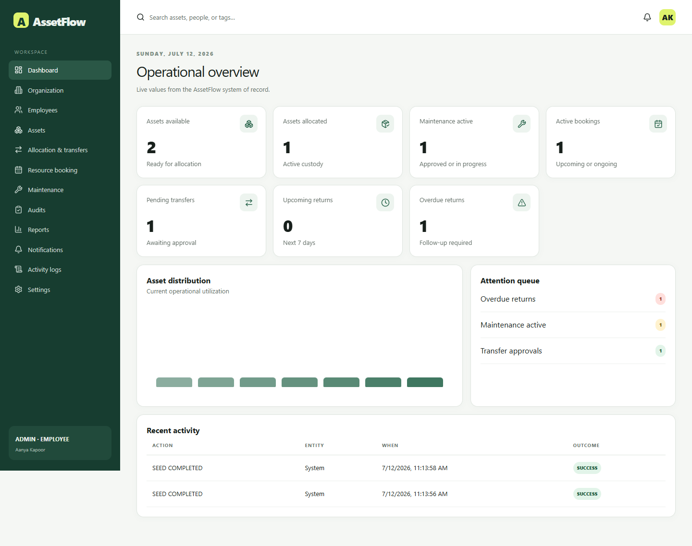
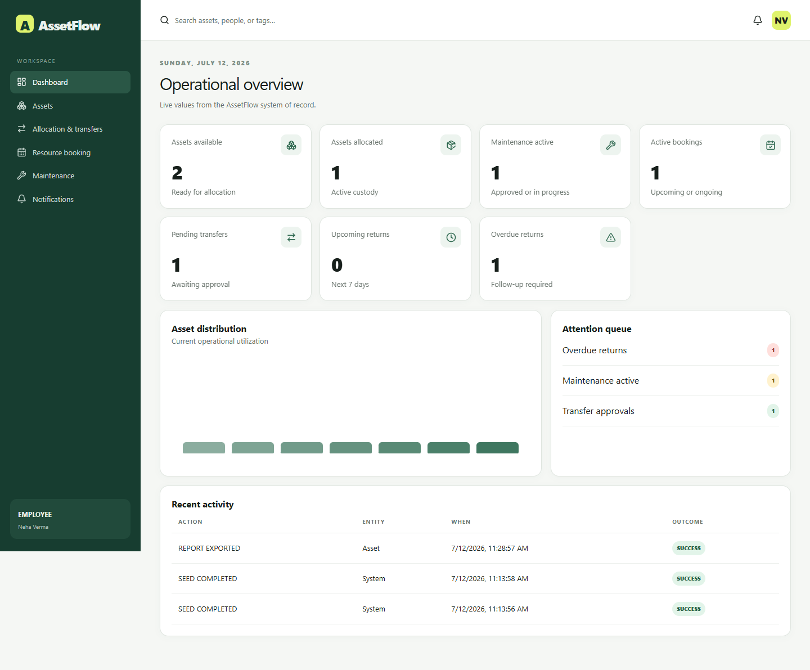
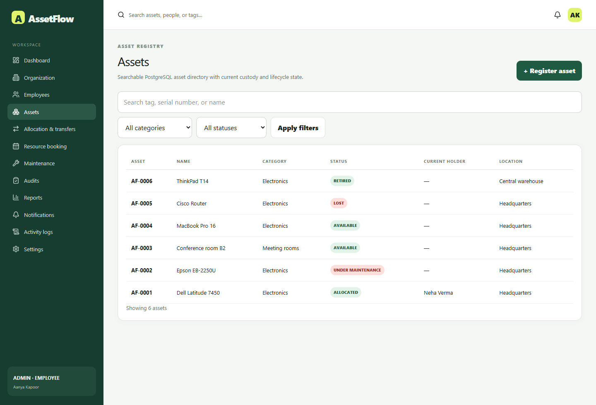
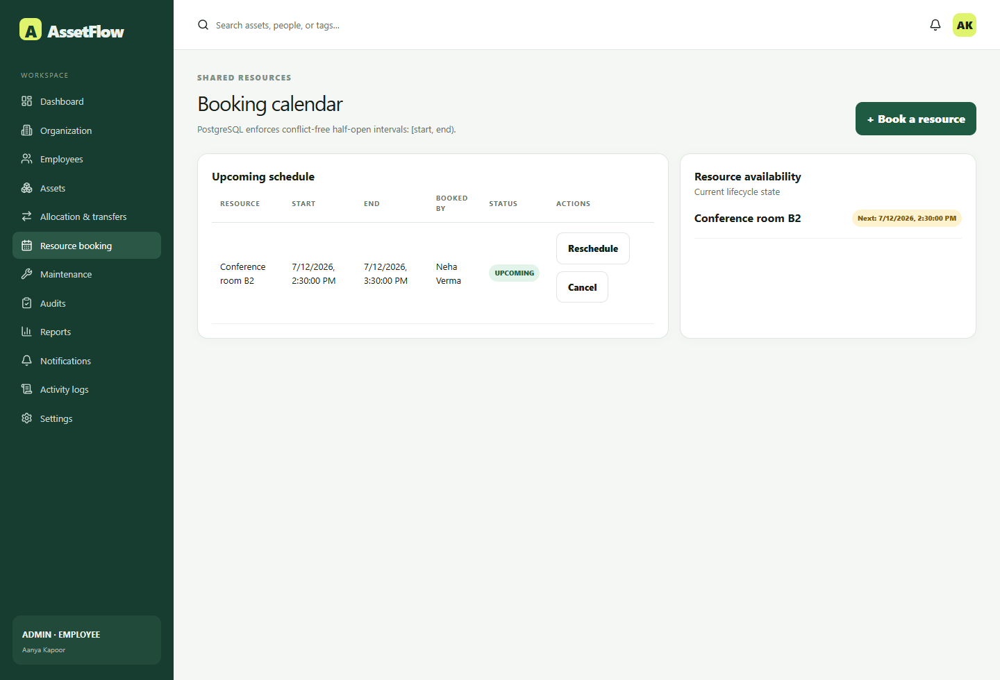

<<<<<<< HEAD
# AssetFlow

Enterprise Asset & Resource Management System for accountable custody, shared-resource scheduling, maintenance, audits, and operational reporting.



## Product overview and problem statement

AssetFlow gives an organization one PostgreSQL-backed source of truth for departments, employees, controlled roles, physical assets, allocations, transfer handovers, returns, shared-resource bookings, maintenance, audits, notifications, and immutable activity history. It intentionally excludes procurement, invoicing, payroll, and accounting.

Compulsory workflows are implemented through authenticated route handlers and transactional domain services. No business record uses browser storage or an in-memory collection as its authority.

## Technology stack

- Node.js 22, pnpm 10.15.0, strict TypeScript 5.9.2
- Next.js 16.2.10 App Router, React 19.2.7, Tailwind CSS 4, Lucide
- Auth.js credentials, bcrypt cost 12, Zod
- PostgreSQL 18, Prisma 6.14, native constraints and triggers
- Vitest, Playwright, ESLint, Prettier
- Docker Compose, GitHub Actions, CodeQL, Dependabot
- Local/S3-compatible uploads and optional SMTP delivery

## Screenshots

| Admin dashboard                                    | Employee dashboard                                             |
| -------------------------------------------------- | -------------------------------------------------------------- |
|  |  |

| Assets                                                   | Booking calendar                                           |
| -------------------------------------------------------- | ---------------------------------------------------------- |
|  |  |

Additional verified captures: [login](docs/screenshots/login.png), [allocation conflict](docs/screenshots/allocation-conflict.png), [maintenance board](docs/screenshots/maintenance-board.png), [audit cycle](docs/screenshots/audit-cycle.png), and [reports](docs/screenshots/reports.png).

## Architecture

```text
Browser / Server Components
  -> authenticated route plus Zod validation
  -> RBAC and department/record scope
  -> transactional domain service
  -> Prisma repository access
  -> PostgreSQL constraints and triggers
```

The worker uses PostgreSQL advisory locking for overdue escalation, booking state/reminders, maintenance SLA alerts, and audit deadlines. See [architecture](docs/ARCHITECTURE.md), [database](docs/DATABASE.md), [API](docs/API.md), and [workflows](docs/WORKFLOWS.md).

## Roles and permissions

| Capability                      |    Admin     | Asset Manager |   Department Head   |    Employee     |     Auditor     |
| ------------------------------- | :----------: | :-----------: | :-----------------: | :-------------: | :-------------: |
| Organization and elevated roles |     Yes      |      No       |         No          |       No        |       No        |
| Register and allocate assets    |     Yes      |      Yes      |         No          |       No        |       No        |
| Transfer approval               |     Yes      |      Yes      |       Scoped        |       No        |       No        |
| Resource booking                |     Yes      |      Yes      |     Department      |       Own       |       No        |
| Maintenance                     |    Manage    |    Manage     | Scoped view/request | Assigned assets |       No        |
| Audits                          | Manage/close | Discrepancies |     Scoped view     |       No        |  Assigned work  |
| Reports and logs                | Organization |  Operational  |     Department      |   Own records   | Assigned audits |

Navigation is generated from roles, but every route, query, and mutation independently checks authorization. Signup rejects role/permission fields and always creates Employee access only.

## Asset lifecycle and workflows

Assets progress through Available, Allocated, Reserved, Under Maintenance, Lost, Retired, and Disposed using a centralized state machine and a PostgreSQL transition trigger.

- Allocation rechecks availability in a Serializable transaction and identifies the current holder on conflict.
- Transfer follows Requested to Approved/Rejected to Completed. Approval never changes custody; confirmed handover closes the old allocation and creates the new one.
- Accepted return closes custody, inspects condition/accessories, changes location, and routes damaged items to maintenance.
- Maintenance follows Pending, Approved, Technician Assigned, In Progress, and Resolved. Pending does not change asset lifecycle.
- Audit cycles freeze expected holder/location/status/condition. Missing or Damaged creates a discrepancy; authorized closure can confirm Lost.
- Bookings use `[start, end)`: 09:00-10:00 and 10:00-11:00 coexist, while 09:30-10:30 conflicts.

## Database overview

The normalized schema includes users, employees, roles, departments, categories and attribute definitions, locations, assets and attachments, lifecycle history, allocations, transfers and approvals, returns, bookings, maintenance, audit cycles/assignments/lines/discrepancies, notifications, activity logs, settings, password-reset tokens, and worker-run deduplication.

PostgreSQL enforces:

- case-insensitive unique emails through `citext`;
- one active allocation per asset;
- one pending/approved transfer per asset;
- GiST booking exclusion over half-open `tstzrange` values;
- active, exactly-one allocation holders;
- lifecycle transition rules;
- immutable accepted returns and closed audit lines.

## Prerequisites and Docker quick start

- Node.js 22 and Corepack for manual development
- Docker/Compose for the preferred evaluator setup

```bash
cp .env.example .env
docker compose up --build
```

The application waits for PostgreSQL health, applies committed migrations, and loads idempotent demo data. Open `http://localhost:3000`.

## Manual setup, migrations, and seed

```bash
corepack enable
pnpm install --frozen-lockfile
docker compose up -d db
pnpm db:deploy
pnpm db:seed
pnpm dev
```

Development migration creation uses `pnpm db:migrate`; deployment and CI use `pnpm db:deploy`. Never use `prisma db push` as a deployment strategy.

## Environment variables

Required: `DATABASE_URL`, `DIRECT_URL`, `AUTH_SECRET`, `AUTH_URL`, `APP_URL`, `UPLOAD_DRIVER`, `UPLOAD_DIR`, and `CRON_SECRET`.

Optional SMTP: `SMTP_HOST`, `SMTP_PORT`, `SMTP_USER`, `SMTP_PASSWORD`, `SMTP_FROM`.

Optional S3: `S3_ENDPOINT`, `S3_REGION`, `S3_BUCKET`, `S3_ACCESS_KEY_ID`, `S3_SECRET_ACCESS_KEY`.

All timestamps are UTC `timestamptz`; presentation uses the organization IANA timezone. Daylight-saving conversion never changes stored instants.

## Demo credentials

All accounts use the demo-only password `AssetFlowDemo!2026`.

| Role            | Email                    |
| --------------- | ------------------------ |
| Admin           | admin@assetflow.local    |
| Asset Manager   | manager@assetflow.local  |
| Department Head | head@assetflow.local     |
| Employee        | employee@assetflow.local |
| Auditor         | auditor@assetflow.local  |

## Testing and production build

```bash
pnpm format:check
pnpm lint
pnpm typecheck
pnpm test
pnpm test:e2e
pnpm build
pnpm ci:check
```

For database integration tests, set `RUN_DB_TESTS=true` and point `TEST_DATABASE_URL` to a dedicated disposable database.

Verified locally on PostgreSQL 18.4:

- all three migrations applied to fresh development and test databases;
- idempotent seed succeeded twice;
- 12/12 unit and database integration tests passed;
- 5/5 authenticated Playwright tests passed, covering every demo account;
- Prisma validation, Prettier, ESLint, strict TypeScript, worker execution, and production build passed;
- the persisted scenario test covers allocation conflict, transfer approval/handover, booking overlap/back-to-back slots, maintenance, return, audit discrepancy, closure, and Lost confirmation.
- a clone of commit `b834430` into an empty directory with no `.env` or `node_modules` passed frozen install, fresh-database migrations, seed, format, lint, types, all 12 database tests, and production build.

Docker Compose configuration is included, but Docker was unavailable on the local verification machine; native PostgreSQL 18 was executed instead. CI uses a PostgreSQL service container.

## Deployment

Use the multi-stage Dockerfile on a Docker host/container platform, or deploy Next.js separately from the worker with managed PostgreSQL. Always run `pnpm db:deploy` before a new application release. Persist local uploads or configure S3. Configure the public HTTPS origin in `AUTH_URL` and `APP_URL`. See [deployment guidance](docs/DEPLOYMENT.md).

## Repository structure

```text
.github/       CI, CodeQL, Dependabot, issue and PR templates
docs/          architecture, database, API, RBAC, workflows, screenshots
prisma/        schema, three migrations, idempotent seed
scripts/       screenshot capture
src/app/       pages and protected route handlers
src/auth/      Auth.js, permissions, actor and scope policy
src/modules/   lifecycle and transactional workflows
src/jobs/      PostgreSQL-locked worker
src/storage/   local and S3-compatible storage
tests/         unit, PostgreSQL integration, Playwright E2E
```

## Security notes

Passwords are bcrypt-hashed; cookies are HTTP-only, SameSite Lax, and Secure in production. Inactive accounts are rejected on login and on subsequent protected requests. Failed logins are tracked and temporarily locked. Password-reset tokens are random, hashed at rest, single-use, expiring, and revoke sessions. Uploads enforce type, size, and safe generated names. Activity logs are not exposed to user mutation.

## Known limitations and future roadmap

S3 and SMTP require deployment credentials. A live production deployment was not performed. Configurable multi-step approval chains, delegated approvals, offline audit mode, predictive maintenance, RFID/IoT, sustainability passports, and AI-assisted damage detection remain future work.

## API, contribution, team, and license

See [API documentation](docs/API.md), [testing](docs/TESTING.md), [CONTRIBUTING.md](CONTRIBUTING.md), [SECURITY.md](SECURITY.md), and [CODE_OF_CONDUCT.md](CODE_OF_CONDUCT.md). Team metadata is editable in `CITATION.cff`. AssetFlow is MIT licensed.
=======
# Odoo-Hackathon-12-07-26
>>>>>>> 46a1a898b19cd393ef06e1d02882d88f1e6fc34b
