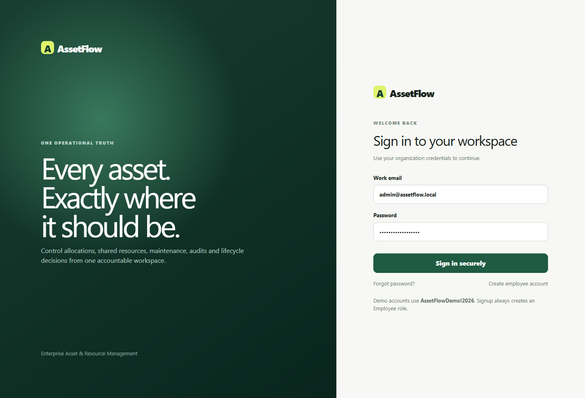
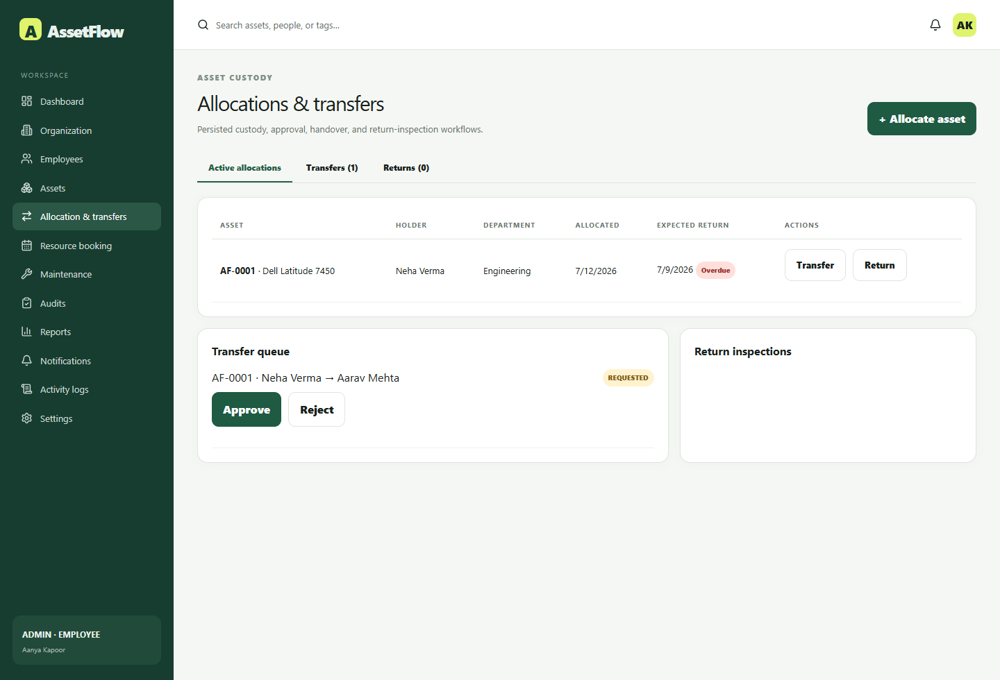
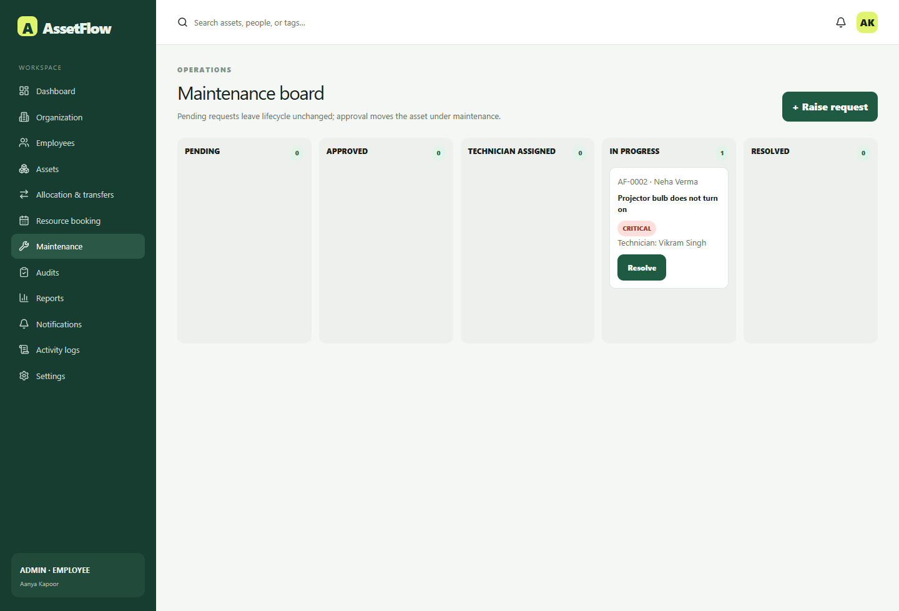
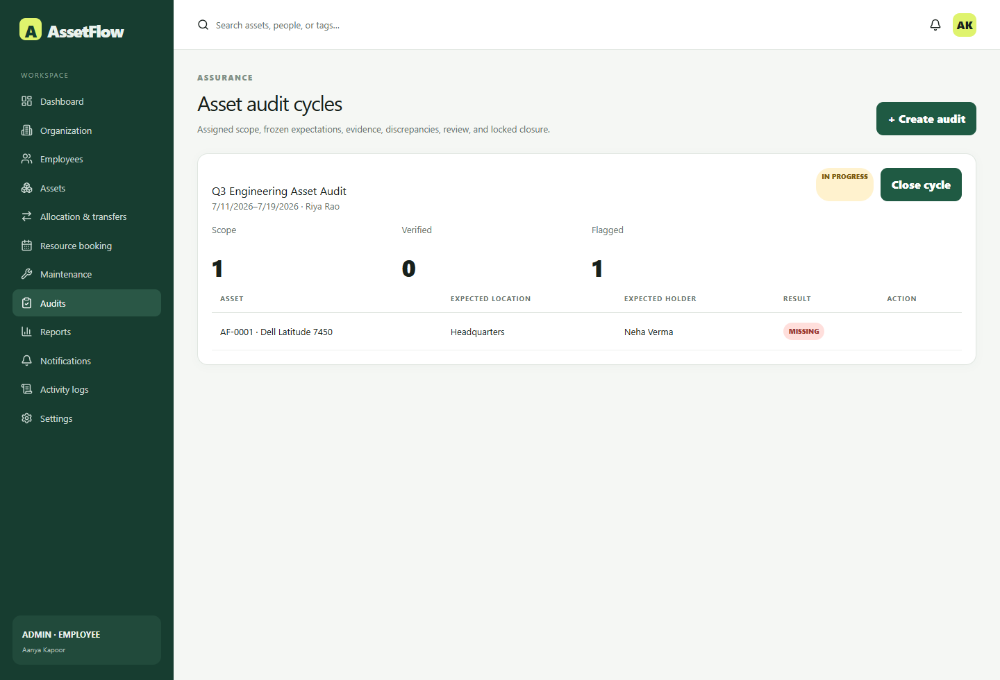
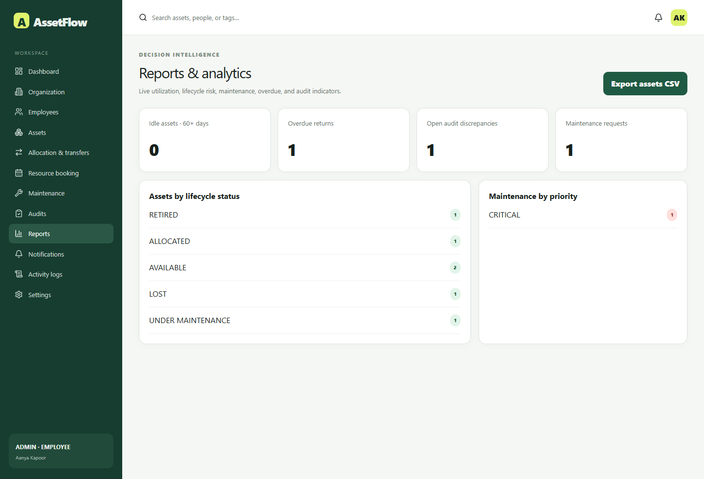

# AssetFlow

> Enterprise asset, resource, maintenance, and audit management in one accountable workspace.



AssetFlow gives operations teams one place to register assets, assign custody, book shared resources, manage maintenance, run audits, and retain an immutable activity trail. It is designed for organizations that need a practical answer to a simple question: **what do we own, where is it, who is responsible for it, and what needs attention?**

## Why AssetFlow

Spreadsheets make it hard to answer basic operational questions reliably. AssetFlow replaces disconnected lists and manual follow-ups with controlled workflows:

- One searchable asset register with tags, serial numbers, condition, location, ownership, and history.
- Accountable employee or department custody, including expected returns and overdue reminders.
- Conflict-free booking for shared rooms, equipment, vehicles, and other bookable resources.
- A maintenance board from request to resolution.
- Repeatable physical audits with discrepancies, evidence, and an immutable closure record.
- Role-based access, notifications, activity logs, and operational reporting.

## Product tour

| Operational dashboard                                    | Asset directory                                          |
| -------------------------------------------------------- | -------------------------------------------------------- |
|  |  |

| Allocation and transfer handling                                          | Shared-resource booking                                    |
| ------------------------------------------------------------------------- | ---------------------------------------------------------- |
|  |  |

| Maintenance workflow                                         | Audit workflow                                   |
| ------------------------------------------------------------ | ------------------------------------------------ |
|  |  |

| Reports                                  | Employee workspace                                             |
| ---------------------------------------- | -------------------------------------------------------------- |
|  |  |

## What users can do

### Register and manage assets

Administrators and Asset Managers register assets with a unique `AF-` tag, category, serial number, condition, owner, and location. Every asset has its own detail page with a QR code, attachments, allocation history, maintenance history, lifecycle timeline, and edit controls. The asset list provides a pen icon for direct management access.

Assets follow a controlled lifecycle:

```text
Available → Allocated / Reserved / Under Maintenance / Lost / Retired
Allocated → Available / Under Maintenance / Lost
Retired → Disposed
```

Deleting an asset is a safe soft-delete: it records a disposal state while retaining audit and workflow history. Assets that are still allocated or under active maintenance cannot be deleted.

### Allocate, transfer, and return custody

An asset can be issued to an employee or a department. Active custody supports an expected return date, issued condition, accessories, notes, and overdue status.

```text
Allocate → Use → Return request → Inspection → Accepted return
                 └→ Transfer request → Approval → Confirmed handover
```

The system prevents two active allocations for the same asset. Transfers preserve the original holder until the handover is confirmed. A damaged return can automatically route the asset into maintenance.

### Book shared resources

Mark an asset as shared to use it as a bookable resource—for example, a meeting room, projector, pool vehicle, lab device, or camera. Users choose a time interval and purpose; SQLite triggers prevent overlapping active bookings while allowing back-to-back slots.

### Manage maintenance

Anyone with maintenance-request permission can raise an issue for an eligible asset. Managers then review, approve, assign a technician, start work, and resolve the request.

```text
Pending → Approved → Technician assigned → In progress → Resolved
```

Asset lifecycle changes only once maintenance is approved. The form validates required details before submission and excludes assets that already have an active maintenance request.

### Run audits with a defensible trail

Create a cycle for the full organization, a department, or a location; assign auditors; then verify expected holder, location, status, and condition. Missing or damaged findings create discrepancies. On closure, audit lines become immutable and missing items can be formally confirmed as lost.

### Manage people and access

The employee directory supports role changes, employee deactivation, and restoration. The **Deleted employees** tab lets an administrator reassign an inactive employee to a department and restore access. Existing workflow history is retained rather than deleted.

Each person can open their own profile from the role/name card at the bottom of the sidebar to view their roles, department, and assets in custody. Signing out from the top-right avatar asks for confirmation.

## Roles and permissions

| Role                | Typical responsibilities                                                                                                     |
| ------------------- | ---------------------------------------------------------------------------------------------------------------------------- |
| **Admin**           | Organization setup, people and role management, asset management, reporting, audit management, and workflow oversight.       |
| **Asset Manager**   | Register/manage assets, allocations, transfers, maintenance, reporting, and activity review.                                 |
| **Department Head** | View shared inventory, coordinate department custody, approve scoped transfers, book resources, and view department reports. |
| **Employee**        | View shared inventory, manage own custody and bookings, raise maintenance requests, and view own profile.                    |
| **Auditor**         | Perform assigned audit work and document verification results and discrepancies.                                             |

Fresh employee accounts can immediately see shared inventory and organization-level operational counts, while management actions remain role-restricted.

## Cross-industry use cases

AssetFlow is deliberately general-purpose. Its workflow model fits organizations wherever equipment, shared spaces, or accountable custody matter.

| Industry                            | Examples                                                                                                  |
| ----------------------------------- | --------------------------------------------------------------------------------------------------------- |
| **IT and SaaS**                     | Laptops, monitors, phones, test devices, conference rooms, and employee onboarding/offboarding.           |
| **Manufacturing**                   | Tools, gauges, machinery, production-floor equipment, calibration cycles, and maintenance requests.       |
| **Healthcare**                      | Mobile clinical equipment, shared diagnostic devices, ward inventory, maintenance, and compliance audits. |
| **Education**                       | Classroom AV, laboratory kits, library equipment, staff laptops, and room booking.                        |
| **Construction and field services** | Vehicles, power tools, safety equipment, site custody, repairs, and asset returns.                        |
| **Logistics and warehousing**       | Scanners, forklifts, pallet equipment, depot resources, and periodic stock audits.                        |
| **Creative and media teams**        | Cameras, lenses, lighting, editing workstations, studio rooms, and project handovers.                     |
| **Public sector and nonprofits**    | Office equipment, field kits, grants-funded inventory, accountability reports, and audit evidence.        |

## How the system is built

```text
Browser / Server Components
        ↓
Authenticated routes + Zod input validation
        ↓
Role and scope checks
        ↓
Transactional workflow services
        ↓
Prisma + SQLite constraints and triggers
        ↓
Activity history, notifications, reports
```

- **Next.js + React + TypeScript** provide the application UI and server routes.
- **Auth.js** provides credentials-based authentication and session handling.
- **Prisma + SQLite** provide a portable, single-file operational database.
- **Zod** validates untrusted input at API boundaries.
- **SQLite indexes and triggers** enforce rules that should never depend on the browser: one active allocation, one pending transfer, conflict-free resource bookings, valid asset transitions, and immutable closed records.
- **Vitest and Playwright** cover workflow rules and browser smoke tests.

## Quick start

### Prerequisites

- Node.js 22 or later
- pnpm 10

### Run locally

```bash
cp .env.example .env
pnpm install --frozen-lockfile
pnpm db:deploy
pnpm db:seed
pnpm dev
```

Open [http://localhost:3000](http://localhost:3000).

The default database URL is `file:./prisma/assetflow.db`. SQLite keeps the application data in one local file, which is ignored by Git. Use a separate file URL such as `file:./prisma/assetflow-test.db` for isolated tests.

### Docker

```bash
cp .env.example .env
docker compose up --build
```

Docker Compose persists the SQLite database in `assetflow_data` and uploads in `assetflow_uploads`.

## Demo accounts

All seeded accounts use password `AssetFlowDemo!2026`.

| Role            | Email                      |
| --------------- | -------------------------- |
| Admin           | `admin@assetflow.local`    |
| Asset Manager   | `manager@assetflow.local`  |
| Department Head | `head@assetflow.local`     |
| Employee        | `employee@assetflow.local` |
| Auditor         | `auditor@assetflow.local`  |

You can also register a new employee account from the login page. New accounts receive the Employee role; an administrator can later assign a department or elevated role.

## Configuration

Copy `.env.example` and set these values:

| Variable                       | Purpose                                            |
| ------------------------------ | -------------------------------------------------- |
| `DATABASE_URL`                 | SQLite file URL.                                   |
| `AUTH_SECRET`                  | At least 32 random characters for session signing. |
| `AUTH_URL` / `APP_URL`         | Public application URL.                            |
| `UPLOAD_DRIVER` / `UPLOAD_DIR` | Local upload storage configuration.                |
| `CRON_SECRET`                  | Secret for scheduled worker execution.             |

SMTP and S3-compatible upload settings are optional and documented in `.env.example`.

## Development commands

```bash
pnpm db:deploy       # apply committed migrations
pnpm db:seed         # load or update demo data
pnpm db:migrate      # create a development migration
pnpm format:check
pnpm lint
pnpm typecheck
pnpm test
pnpm test:e2e
pnpm build
```

## Project structure

```text
src/app/        Pages and route handlers
src/auth/       Authentication, roles, permissions, and scope policies
src/components/ Shared forms, navigation shell, and UI primitives
src/modules/    Transactional allocation, booking, maintenance, and audit workflows
src/jobs/       Operational reminders and notification sweep
prisma/         SQLite schema, migration baseline, and idempotent seed
docs/           Architecture, API, database, testing, and workflow notes
tests/          Unit, integration, and browser tests
```

## Data, safety, and lifecycle notes

- Data is stored in SQLite; back up the database file before upgrades or infrastructure changes.
- Browser clients never write directly to the database.
- Asset and employee deletion is intentionally non-destructive: assets are disposed and employees are deactivated, preserving operational history.
- `prisma/legacy-postgresql-migrations` contains archived historical PostgreSQL SQL for reference only. It is not part of the active SQLite migration chain.

## Further documentation

- [Architecture](docs/ARCHITECTURE.md)
- [Database](docs/DATABASE.md)
- [API](docs/API.md)
- [Workflows](docs/WORKFLOWS.md)
- [Testing](docs/TESTING.md)
- [Deployment](docs/DEPLOYMENT.md)
